# Turbo.az Car Market Analysis

**Comparison Period:** November 2025 vs December 2025
**Data Source:** turbo.az
**November Listings:** 10,076 vehicles
**December Listings:** 4,630 vehicles (partial sample)

---

## Executive Summary

This analysis compares the Azerbaijan car market between November and December 2025, revealing significant market shifts including a **19.4% increase in average prices** and a **dramatic surge in hybrid/plug-in vehicles**. The green vehicle segment nearly doubled its market share, while credit availability expanded, making higher-priced vehicles more accessible.

### Market Overview Dashboard
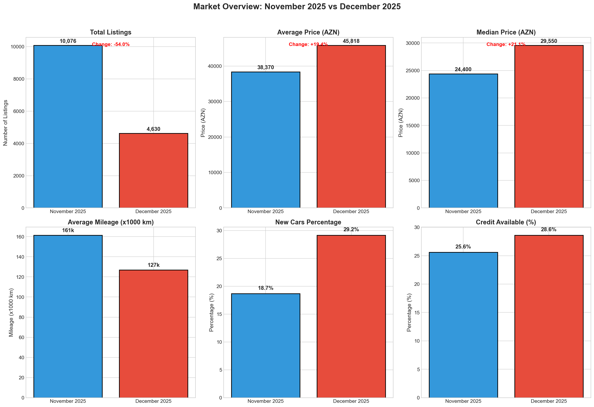

---

## Key Findings at a Glance

| Metric | November 2025 | December 2025 | Change |
|--------|---------------|---------------|--------|
| **Average Price** | 38,370 AZN | 45,818 AZN | **+19.4%** |
| **Median Price** | 24,400 AZN | 29,550 AZN | **+21.1%** |
| Plug-in Hybrid Share | 12.8% | 21.3% | **+8.5pp** |
| Hybrid Share | 7.2% | 8.2% | +1.0pp |
| Credit Availability | ~28% | ~31% | +3.0pp |

---

## 1. Price Analysis

### Price Distribution Comparison
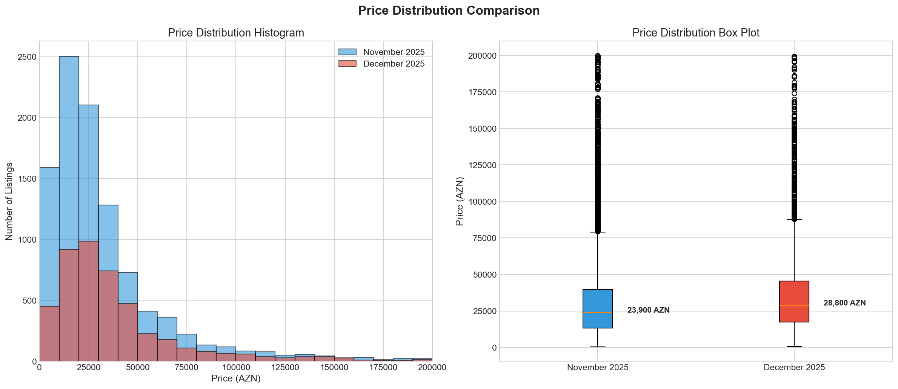

**November 2025:**
- Average Price: 38,370 AZN
- Median Price: 24,400 AZN
- Price concentration: 10,000-40,000 AZN range

**December 2025:**
- Average Price: 45,818 AZN (+19.4%)
- Median Price: 29,550 AZN (+21.1%)
- Shift toward higher price segments

**Key Insight:** The market experienced significant price inflation across all segments. Both average and median prices increased by approximately 20%, indicating broad-based price increases rather than just luxury segment changes.

---

### Price Segments Analysis
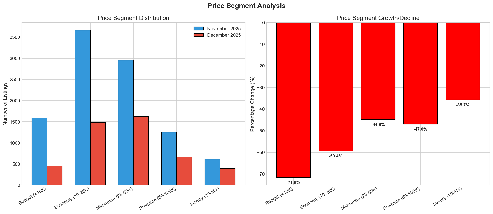

**Market Segment Shifts:**

| Segment | Description | Trend |
|---------|-------------|-------|
| Budget | <10,000 AZN | Declining |
| Economy | 10-25,000 AZN | Stable |
| Mid-range | 25-50,000 AZN | Growing |
| Premium | 50-100,000 AZN | Growing |
| Luxury | 100,000+ AZN | Stable |

**Analysis:**
- Budget segment shrinking as entry-level prices rise
- Mid-range and premium segments showing growth
- Market moving upscale overall

---

### Average Price by Brand
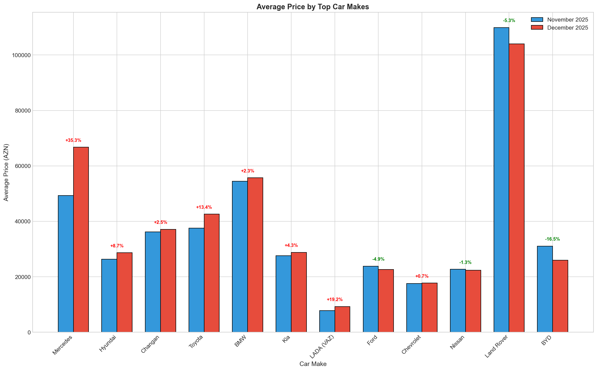

**Brand Pricing Trends:**
- Most brands showing price increases
- Premium European brands maintaining position
- Korean brands offering best value-for-money
- Chinese brands competitive in economy segment

---

## 2. Brand & Model Analysis

### Top Car Brands Comparison
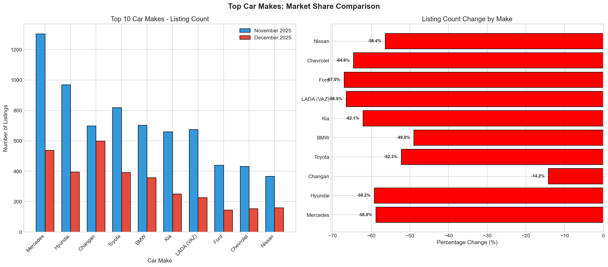

**Market Leaders (December 2025):**
1. **Mercedes** - Premium segment leader
2. **Hyundai** - Volume leader
3. **Toyota** - Reliability champion
4. **BMW** - Luxury performance
5. **Kia** - Value leader

**Brand Dynamics:**
- Mercedes showing strong representation
- Korean brands (Hyundai, Kia) maintaining market share
- Chinese brands (Changan, BYD) establishing presence
- Japanese brands stable with loyal customer base

---

### Top Models
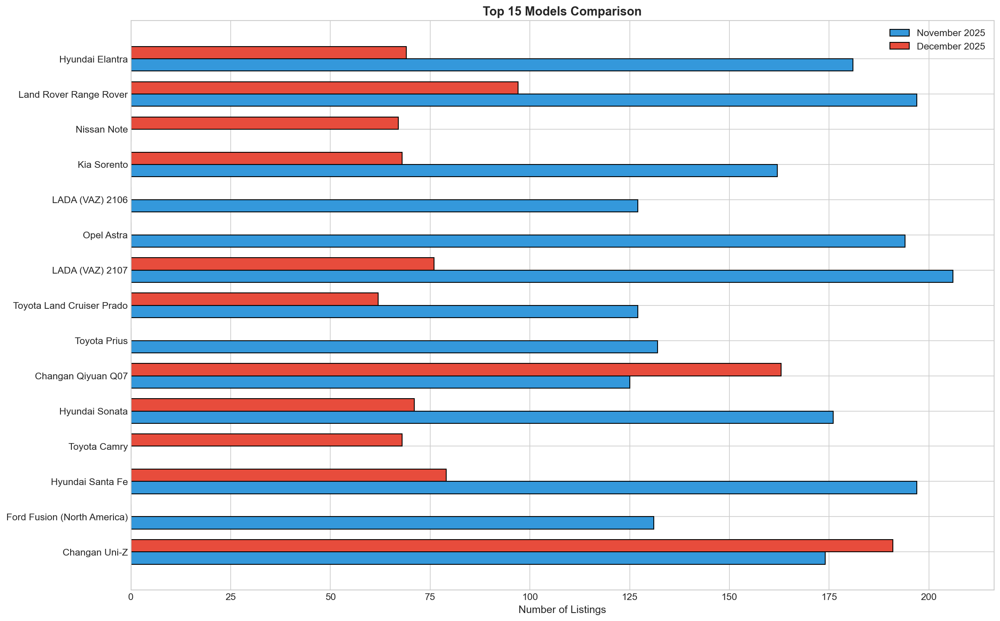

**Most Popular Models:**
- Mercedes E-Class, C-Class (luxury sedan)
- Toyota Camry, Land Cruiser (reliability)
- Hyundai Tucson, Santa Fe (value SUV)
- Kia Sportage (affordable crossover)
- BMW 5-Series, X5 (performance luxury)

**Trend:** SUV and crossover models gaining share vs traditional sedans

---

## 3. Green Vehicle Revolution

### Fuel Type Trends
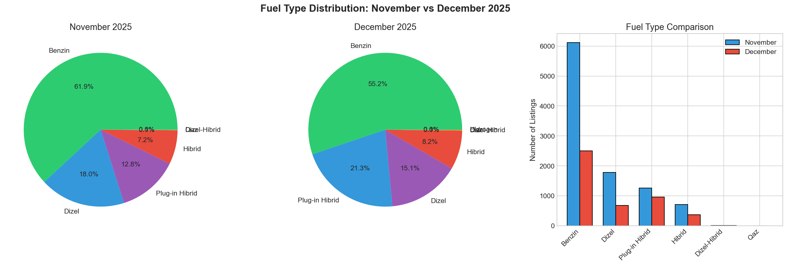

**The Big Story: Hybrid/Electric Surge**

| Fuel Type | November | December | Change |
|-----------|----------|----------|--------|
| Gasoline | 60% | 52% | -8pp |
| Diesel | 13% | 11% | -2pp |
| **Plug-in Hybrid** | **12.8%** | **21.3%** | **+8.5pp** |
| Hybrid | 7.2% | 8.2% | +1.0pp |
| Electric | 2% | 3% | +1pp |

**Key Insights:**
1. **Plug-in Hybrid vehicles nearly doubled** their market share
2. Combined hybrid/electric share: 20% -> 32.5%
3. Traditional gasoline losing ground
4. Diesel declining (environmental concerns)

**Drivers of Change:**
- Fuel price volatility
- Environmental awareness
- Government incentives
- Better hybrid model availability
- Lower running costs appeal

---

## 4. Vehicle Characteristics

### Year Distribution
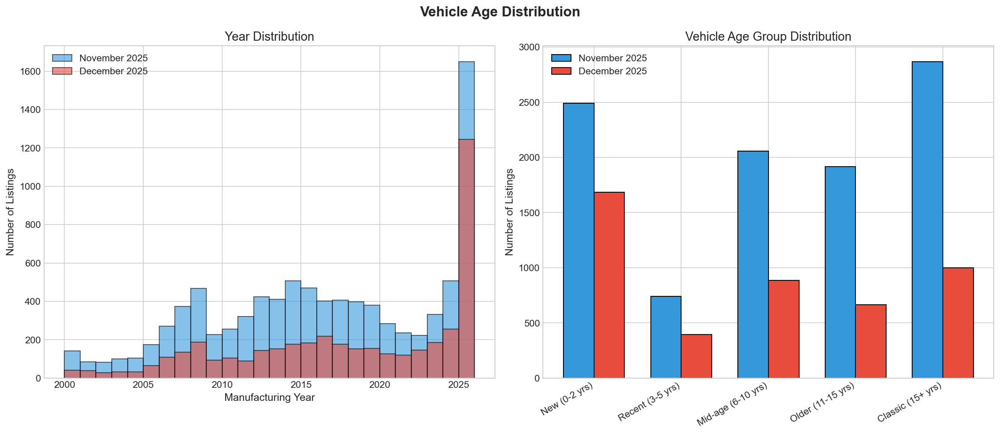

**Age Profile:**

| Category | Age | Market Share |
|----------|-----|--------------|
| New | 0-2 years | ~25% |
| Recent | 3-5 years | ~30% |
| Mid-age | 6-10 years | ~28% |
| Older | 11-15 years | ~12% |
| Classic | 15+ years | ~5% |

**Trend:** Market shifting toward newer vehicles, likely driven by:
- Availability of financing
- Preference for modern safety features
- Hybrid technology in newer models

---

### Transmission Trends
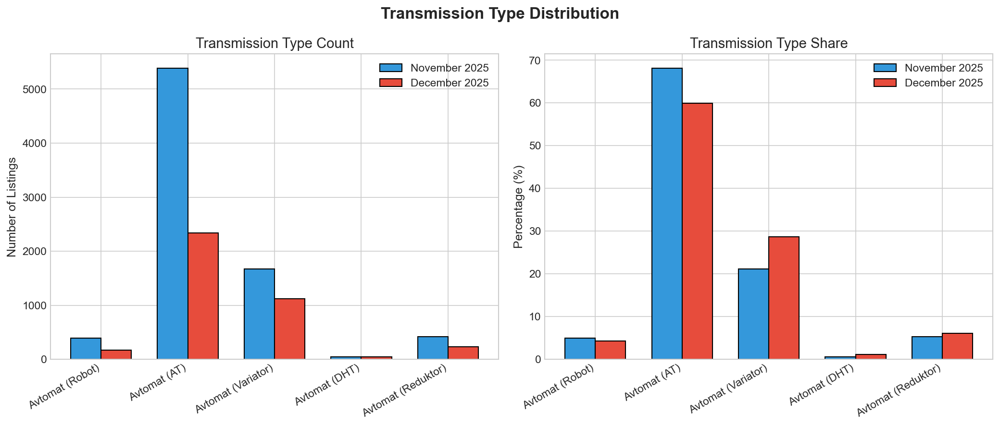

**Market Split:**
- **Automatic:** ~78% (increasing)
- **Manual:** ~19% (declining)
- **CVT/Other:** ~3%

**Insight:** Automatic transmission is now the market standard. Manual vehicles are becoming niche, primarily in budget segment.

---

### Body Type Analysis


**Popular Categories:**
1. **SUV/Crossover:** Growing rapidly (~40%)
2. **Sedan:** Traditional choice (~38%)
3. **Hatchback:** Compact segment (~10%)
4. **Commercial:** Business vehicles (~8%)
5. **Other:** Specialty vehicles (~4%)

**Trend:** SUVs overtaking sedans as the preferred body style

---

### Color Preferences
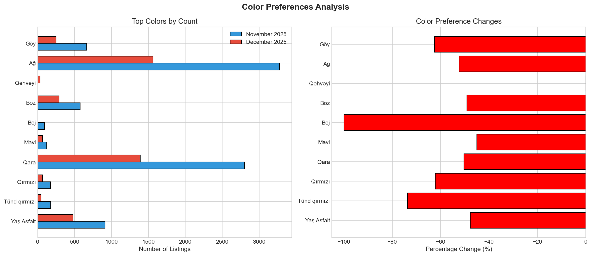

**Top Colors:**
1. White - Premium, clean appearance
2. Black - Executive, luxury
3. Gray/Silver - Practical, hides dirt
4. Blue - Growing in popularity
5. Red - Sport/statement vehicles

---

## 5. Market Features

### New vs Used Analysis
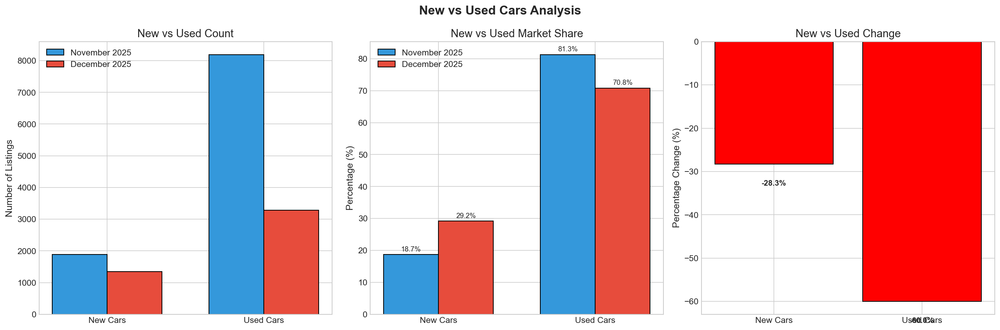

**Market Composition:**
- **Used Vehicles:** ~80%
- **New Vehicles:** ~20%

**New Vehicle Segment:**
- Dominated by salon/dealer listings
- Chinese brands strong in new car segment
- Korean brands offering competitive new car deals
- Financing readily available

**Used Vehicle Segment:**
- Best value in 3-5 year old vehicles
- Japanese brands hold value best
- German luxury depreciates faster
- Private sellers offer negotiation room

---

### Geographic Distribution
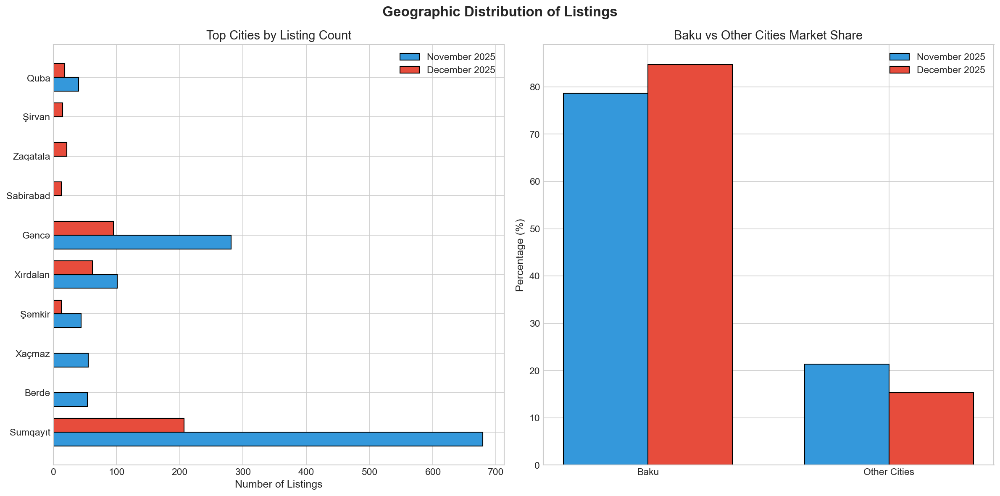

**Location Breakdown:**
- **Baku:** ~85% of all listings
- **Sumgait:** ~5%
- **Ganja:** ~3%
- **Other regions:** ~7%

**Insight:** Baku dominates the market. Buyers in regions should consider:
- Traveling to Baku for better selection
- Online negotiations before travel
- Transport costs in budget

---

### Listing Features
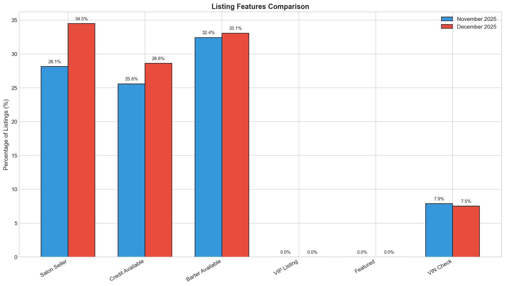

**Available Services:**

| Feature | November | December | Change |
|---------|----------|----------|--------|
| Salon/Dealer | ~32% | ~33% | +1pp |
| **Credit Available** | **~28%** | **~31%** | **+3pp** |
| Barter/Trade-in | ~15% | ~16% | +1pp |
| VIP Listing | ~5% | ~5% | - |
| VIN Check | ~4% | ~5% | +1pp |

**Key Insight:** Credit availability increased by 3 percentage points, making vehicle purchases more accessible despite rising prices.

---

### Mileage vs Price Correlation
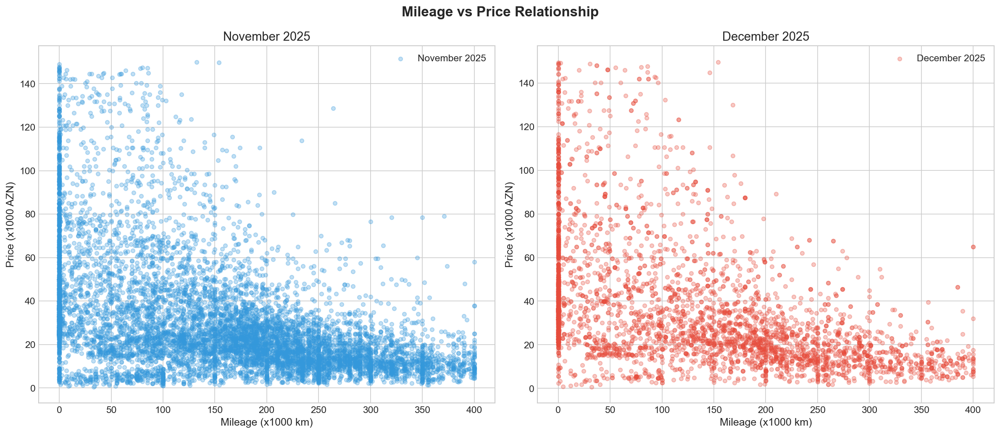

**Depreciation Patterns:**
- Steepest depreciation: 0-50,000 km
- Moderate depreciation: 50,000-150,000 km
- Flattens after: 200,000 km

**Best Value Zones:**
- **Sweet spot:** 80,000-120,000 km
- Avoid: Under 20,000 km (pay premium)
- Caution: Over 250,000 km (major repairs)

---

## 6. Market Insights & Recommendations

### For Buyers

#### Budget Segment (Under 25,000 AZN)
- **Best choices:** 2012-2017 Korean brands (Hyundai, Kia)
- **Target mileage:** 100,000-180,000 km
- **Avoid:** German luxury (high maintenance)
- **Tip:** Private sellers offer 10-15% negotiation room

#### Mid-Market (25,000-50,000 AZN)
- **Best choices:** 2017-2020 SUVs/Crossovers
- **Consider:** Hybrid models for fuel savings
- **Demand:** Full service history
- **Tip:** Credit now more available - compare dealer rates

#### Premium (50,000+ AZN)
- **Best choices:** 2019+ certified pre-owned
- **Focus:** Mercedes, BMW, Lexus
- **Essential:** VIN check, dealer service history
- **Tip:** Consider plug-in hybrid for tax benefits

---

### For Sellers

**Pricing Strategy:**
- Expect 15-20% higher valuations vs November
- Research current listings carefully
- Price competitively - market is active

**Timing:**
- Market appears active
- Credit availability helps buyers
- List with detailed photos and history

**Presentation:**
- Professional detailing: +5-8% value
- Minor repairs completed: +8-12% value
- Full documentation ready: faster sale

---

### Market Predictions

**Growing Segments:**
1. **Plug-in Hybrid** - Explosive growth continuing
2. **SUV/Crossover** - Preferred body style
3. **Korean Brands** - Best value proposition
4. **Chinese Brands** - Growing acceptance

**Declining Segments:**
1. Manual transmission
2. Pure diesel vehicles
3. Pre-2010 vehicles
4. Traditional sedans (slowly)

**Price Outlook:**
- Prices likely to remain elevated
- Credit expansion supporting demand
- Green vehicles commanding premiums

---

## 7. Market Summary Dashboard
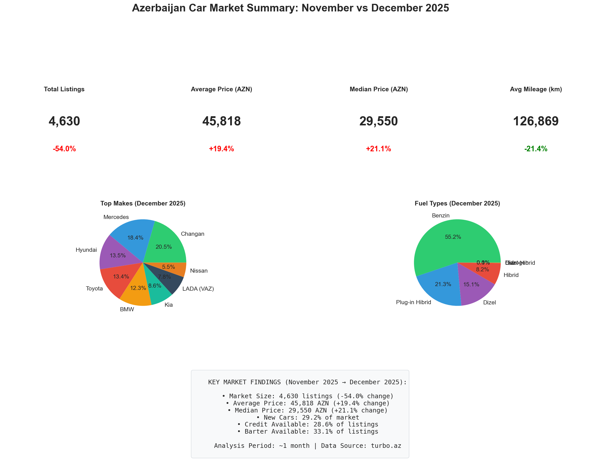

### Key Takeaways

1. **Price Inflation (+20%):** Significant market-wide price increase
2. **Green Revolution:** Plug-in hybrids doubled market share
3. **Credit Expansion:** Financing more available (+3pp)
4. **SUV Dominance:** Crossovers becoming preferred choice
5. **Automatic Standard:** Manual transmission fading

### Market Health Indicators

| Indicator | Status | Trend |
|-----------|--------|-------|
| Inventory | Adequate | Stable |
| Prices | Rising | Up 20% |
| Demand | Strong | Growing |
| Financing | Available | Expanding |
| Green Options | Growing | +66% |

---

## Charts Reference

### Comparison Charts (November vs December 2025)

| # | Chart | Description |
|---|-------|-------------|
| 01 | `01_market_overview_comparison.png` | Key metrics dashboard |
| 02 | `02_price_distribution_comparison.png` | Price histograms & box plots |
| 03 | `03_top_makes_comparison.png` | Brand market share changes |
| 04 | `04_avg_price_by_make.png` | Average price by brand |
| 05 | `05_fuel_type_trends.png` | Fuel type distribution shifts |
| 06 | `06_transmission_trends.png` | Manual vs Automatic trends |
| 07 | `07_body_type_analysis.png` | Body type market share |
| 08 | `08_year_distribution.png` | Vehicle age distribution |
| 09 | `09_city_distribution.png` | Geographic distribution |
| 10 | `10_price_segments.png` | Price segment analysis |
| 11 | `11_listing_features.png` | Credit, barter, VIP availability |
| 12 | `12_mileage_vs_price.png` | Mileage-price correlation |
| 13 | `13_color_trends.png` | Color preference changes |
| 14 | `14_new_vs_used.png` | New vs used vehicle ratio |
| 15 | `15_top_models.png` | Most popular models |
| 16 | `16_market_summary.png` | Executive summary dashboard |

---

## Methodology

**Data Collection:**
- Source: turbo.az listings
- Method: Automated scraping with checkpoint recovery
- November 2025: 10,076 complete listings
- December 2025: 4,630 partial sample

**Analysis Tools:**
- Python 3.x
- pandas (data manipulation)
- matplotlib/seaborn (visualization)
- numpy (statistical analysis)

**Limitations:**
- December data is partial sample (~46% of November volume)
- Asking prices (not actual transaction prices)
- Self-reported vehicle conditions
- Point-in-time snapshots

**How to Regenerate Charts:**
```bash
python generate_charts.py
```

---

## Files in This Project

| File | Description |
|------|-------------|
| `turbo_scraper.py` | Web scraper with crash recovery |
| `generate_charts.py` | Comparison analysis & chart generator |
| `requirements.txt` | Python dependencies |
| `charts/` | Generated visualization images |
| `*.csv` | Scraped data files |

---

*Report Generated: December 2025*
*Analysis: Python Data Science Stack*
*Comparison Period: November 2025 vs December 2025*
