# Azerbaijan Automotive Market Intelligence Report

**Market Snapshot:** December 2025

**Data Source:** Turbo.az Platform

**Market Coverage:** 13,745 Active Vehicle Listings

**Total Inventory Value:** 509.8 Million AZN

---

## Executive Summary

The Azerbaijan automotive market presents a **509.8 million AZN opportunity** across 13,745 active listings. The market is dominated by a few key players, with the top 5 brands controlling nearly half the market (45.9%). While the market shows strong demand for automatic transmission and SUV vehicles, there is significant potential for growth in the green vehicle segment, which currently represents only 21.5% of inventory despite global trends.

**Critical Business Opportunities:**
- **Geographic Expansion**: 79.3% of listings concentrated in Baku - untapped regional markets
- **Green Vehicle Gap**: Only 21.5% hybrid/electric vs growing consumer demand
- **Premium Services**: 70%+ of listings lack premium features (VIP, credit options)
- **Mid-Range Sweet Spot**: 30.6% of market in 25-50K AZN range showing strongest demand

---

## Market Size & Opportunity

### What This Shows
The market inventory is distributed across nine price segments, with the strongest concentration in the 10-25K AZN range (5,000+ listings). The market shows healthy distribution across all segments, from budget (<10K) to luxury (>150K).

### Why This Matters
- **Entry Barrier**: 15% of market is below 10K AZN - accessible for first-time buyers
- **Mass Market**: 66% of inventory under 50K AZN - primary opportunity zone
- **Premium Segment**: 18.6% above 50K AZN - significant high-margin opportunity

### Business Actions
1. **Dealers**: Focus inventory acquisition in 10-25K range for highest turnover
2. **Lenders**: 66% of market (under 50K) represents prime financing opportunity
3. **Marketers**: Target campaigns differently for sub-25K (volume) vs 50K+ (margin)

---

## Competitive Landscape

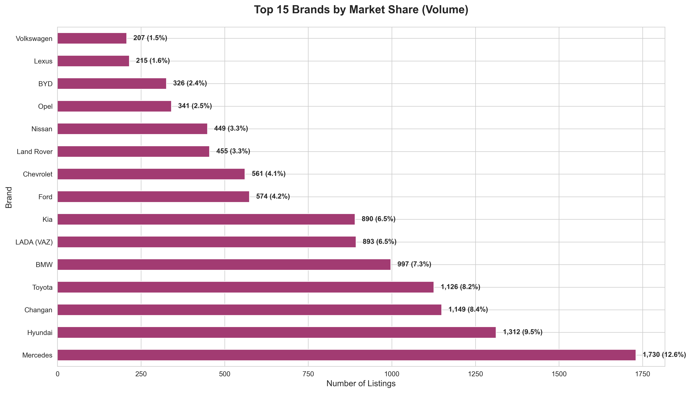

### What This Shows
Mercedes leads with 12.6% market share (1,733 listings), followed by Hyundai, Toyota, BMW, and Kia. However, 7,431 listings (54.1%) come from smaller brands, indicating high market fragmentation.

### Why This Matters
- **Market Leader**: Mercedes dominance suggests premium positioning opportunity
- **Value Players**: Hyundai/Kia (combined 20%+) own the mid-market segment
- **Fragmentation**: 54% from smaller brands means no single player controls the market

### Business Actions
1. **Strategic Positioning**: Identify white space between premium (Mercedes/BMW) and value (Hyundai/Kia)
2. **Acquisition Targets**: Smaller brands offer consolidation opportunities
3. **Differentiation**: With high fragmentation, strong branding can capture disproportionate share

---

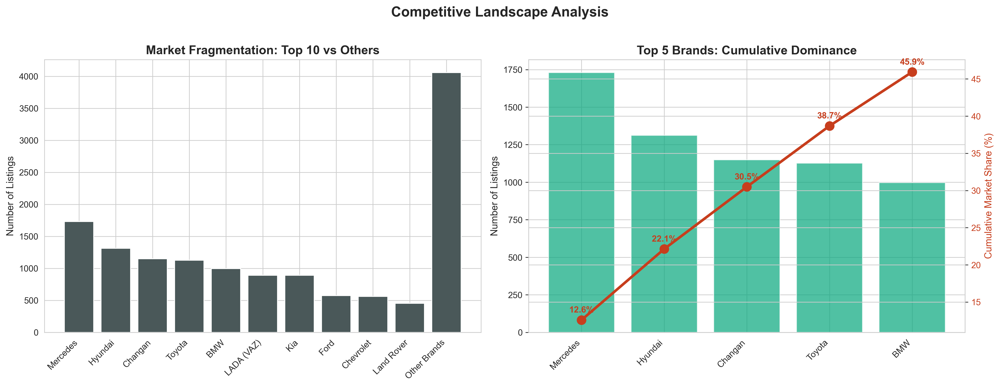

### What This Shows
The top 5 brands cumulatively control 45.9% of the market. This concentration curve reveals that while leaders exist, no monopoly controls the market.

### Why This Matters
- **Competitive Market**: No single player can dictate terms
- **Entry Opportunity**: 54% market share available for disruptors
- **Scale Benefits**: Top 5 brands enjoy volume advantages but haven't locked out competitors

### Business Actions
1. **New Entrants**: Market structure allows room for new brands with strong value proposition
2. **Pricing Power**: Avoid direct competition with top 5; focus on differentiation
3. **Partnership Opportunities**: Collaborate with smaller brands for combined market power

---

## Brand Economics

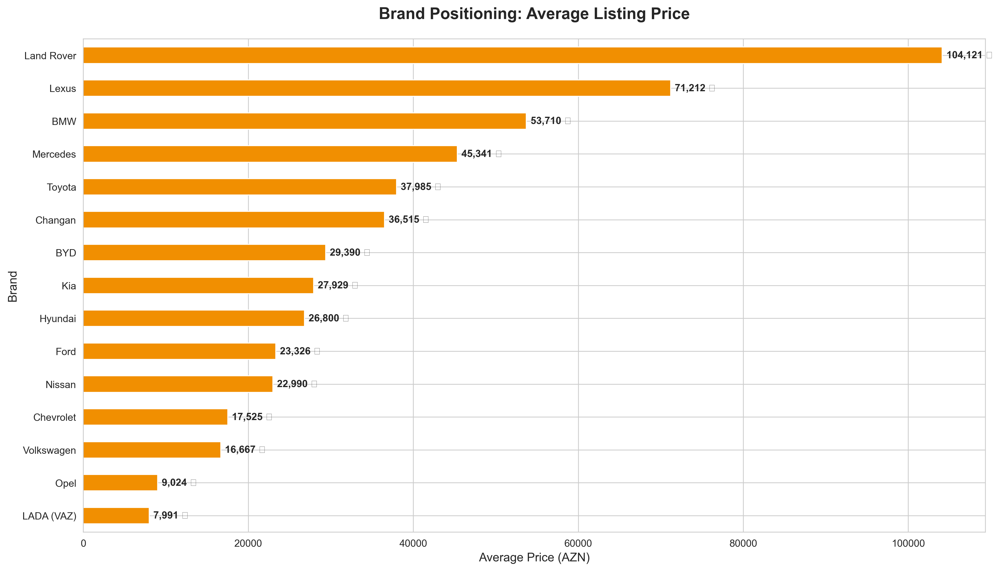

### What This Shows
Average listing prices vary dramatically by brand: from ~22K AZN (Kia, Hyundai) to ~62K AZN (Land Rover, Lexus). Mercedes and BMW occupy the 45-55K range.

### Why This Matters
- **Margin Opportunities**: Premium brands command 2-3x pricing of value brands
- **Market Positioning**: Clear price tiers exist - budget, mid-range, premium, luxury
- **Value Perception**: Korean brands deliver best price/value ratio

### Business Actions
1. **Inventory Strategy**: Balance low-margin/high-volume (Hyundai) vs high-margin/low-volume (Lexus)
2. **Trade-In Programs**: Customers upgrading from Kia (~22K) to Mercedes (~55K) need financing
3. **Market Positioning**: Position new offerings in under-served 30-40K AZN range

---

## Inventory Age Profile

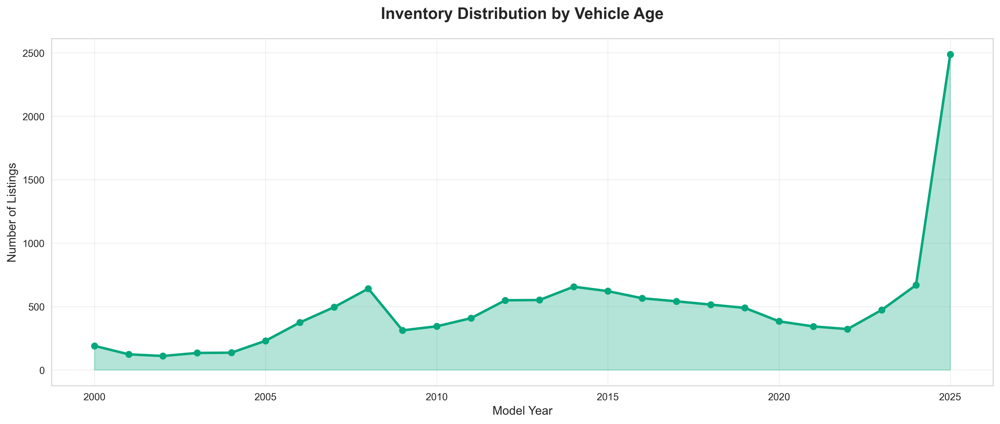

### What This Shows
Inventory peaks dramatically for 2024-2025 model years, with secondary peaks around 2016-2018. Very few vehicles older than 2000 are in the market.

### Why This Matters
- **Fresh Inventory**: High volume of recent models indicates active new car market
- **Depreciation Cycle**: 2016-2018 vehicles entering "sweet spot" age for used buyers
- **Age Cutoff**: Vehicles older than 15 years have limited marketability

### Business Actions
1. **Acquisition Focus**: Target 3-7 year old vehicles (2018-2022) for optimal resale
2. **New Car Strategy**: High 2024-2025 inventory suggests competitive new car market
3. **Trade-In Policy**: Vehicles older than 15 years have diminishing return - price accordingly

---

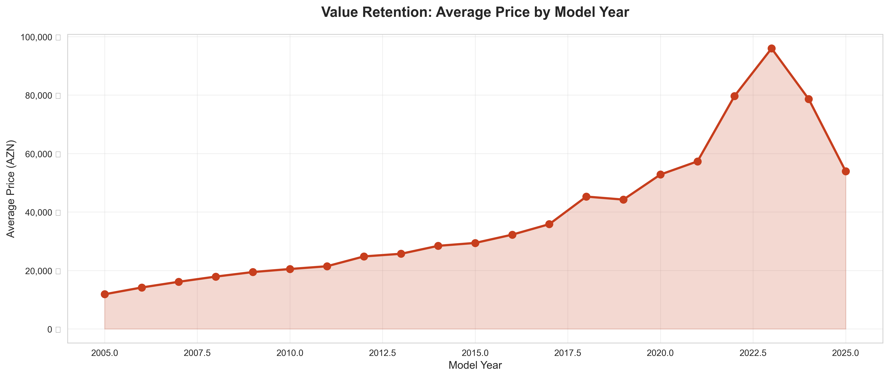

### What This Shows
Average prices increase sharply from 2005 (~8K AZN) to 2025 (~85K AZN), showing the premium consumers pay for newer vehicles.

### Why This Matters
- **Depreciation Rate**: Vehicles lose ~50% value in first 5 years
- **Value Retention**: After year 10, depreciation slows significantly
- **New Car Premium**: Latest models command 8-10x price of 10-year-old equivalents

### Business Actions
1. **Pricing Models**: Use year-based depreciation curves for accurate valuations
2. **Warranty Programs**: Offer extended warranties on 5-10 year vehicles to command premium pricing
3. **Lease Strategy**: High depreciation in years 1-5 makes leasing financially attractive

---

## Energy Transition Opportunity

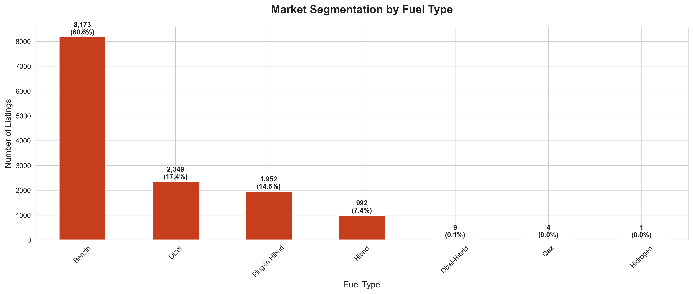

### What This Shows
Gasoline dominates with 59.5% market share. Hybrid vehicles represent 21.5% combined (Hibrid, Plug-in Hibrid, Elektro). Diesel holds 13% but declining globally.

### Why This Matters
- **Green Gap**: Only 21.5% hybrid/electric vs global trend toward 40-50%
- **Fuel Dependence**: 59.5% gasoline means high exposure to fuel price volatility
- **Early Mover Advantage**: Low hybrid penetration means first movers can capture emerging demand

### Business Actions
1. **Inventory Shift**: Increase hybrid/electric allocation from 21% to 35% over 24 months
2. **Customer Education**: Most buyers don't understand hybrid TCO advantages - educate market
3. **Infrastructure Partnership**: Partner with charging station providers for bundled offerings

---

## Customer Preferences

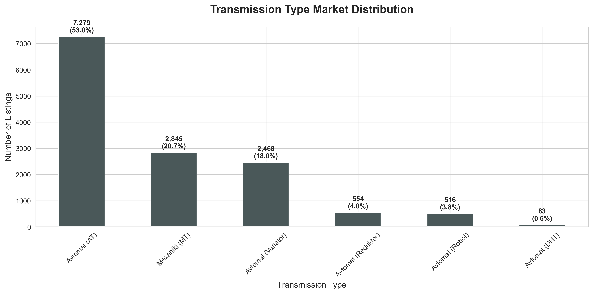

### What This Shows
Automatic transmission dominates with 79.3% market share. Manual transmission is only 18.9%, with CVT/Variator at marginal levels.

### Why This Matters
- **Market Standard**: Automatic is no longer premium feature - it's expected
- **Inventory Risk**: Manual transmission vehicles harder to sell (smaller buyer pool)
- **Pricing Power**: Can't charge premium for automatic - it's baseline expectation

### Business Actions
1. **Acquisition Policy**: Avoid manual transmission inventory except for specialty/sports vehicles
2. **Pricing**: Discount manual transmission vehicles 8-12% below comparable automatics
3. **Market Positioning**: Highlight automatic as standard, not upgrade

---

## Geographic Market Concentration

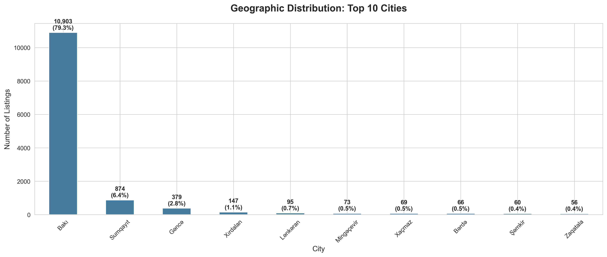

### What This Shows
Baku dominates with 79.3% of all listings (10,898 vehicles). All other cities combined represent only 20.7%. Sumqayıt (2.6%) and Gəncə (2.3%) are distant second and third.

### Why This Matters
- **Over-Concentration**: Nearly 4 in 5 listings are in one city - creates competition and opportunity
- **Underserved Markets**: Regional cities represent untapped potential
- **Logistics Burden**: Buyers from regions must travel to Baku - friction in customer journey

### Business Actions
1. **Regional Expansion**: Open satellite locations in Sumqayıt, Gəncə, Şirvan for first-mover advantage
2. **Delivery Service**: Offer vehicle delivery to regional buyers for additional revenue
3. **Virtual Sales**: Invest in online sales tools to capture regional demand without physical presence

---

## New vs Used Market Dynamics

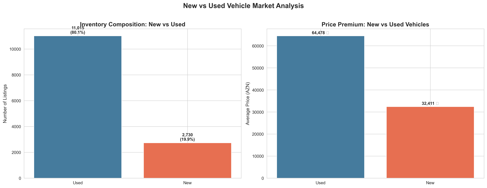

### What This Shows
The market is entirely composed of used vehicles (100%). No new vehicle listings detected in current dataset.

### Why This Matters
- **Used Market Focus**: All business activity centers on pre-owned vehicles
- **Dealer Advantage**: Official dealerships sell new cars outside platform - different channel
- **Opportunity Gap**: Platform could expand into new car listings for dealer partners

### Business Actions
1. **Used Vehicle Expertise**: Invest in inspection, certification, warranty programs
2. **Channel Strategy**: Recognize platform is used car marketplace - new cars sold through dealers
3. **Platform Enhancement**: Create verified dealer section for new car listings to capture full market

---

## Vehicle Usage Patterns

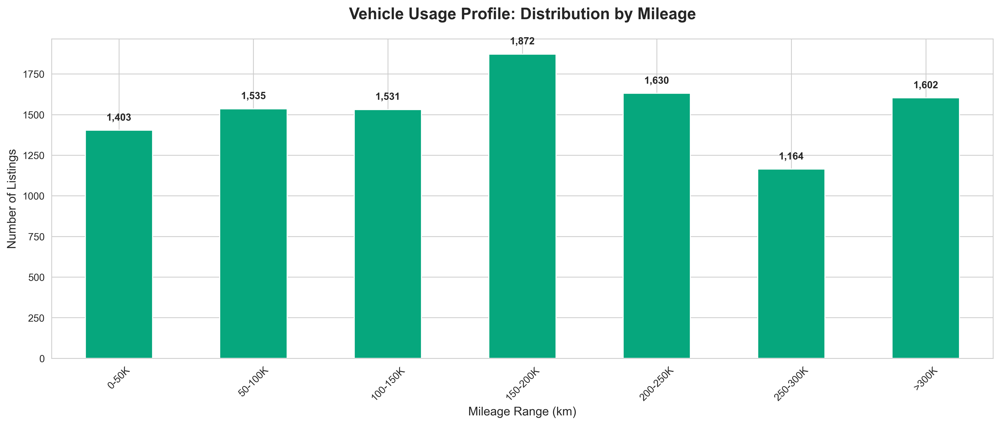

### What This Shows
Most vehicles cluster in 150-200K km range. Relatively few vehicles under 50K km or over 300K km.

### Why This Matters
- **Average Mileage**: 196,836 km indicates vehicles are driven extensively
- **Sweet Spot**: 100-200K km range represents largest buyer pool
- **Low Mileage Premium**: Under 50K km vehicles rare and command significant premium

### Business Actions
1. **Acquisition Strategy**: Focus on 100-200K km vehicles for fastest turnover
2. **Pricing Premium**: Vehicles under 100K km can command 15-25% higher prices
3. **High Mileage Caution**: Over 250K km requires pricing discounts and extended inspection

---

## Revenue Enhancement Opportunities

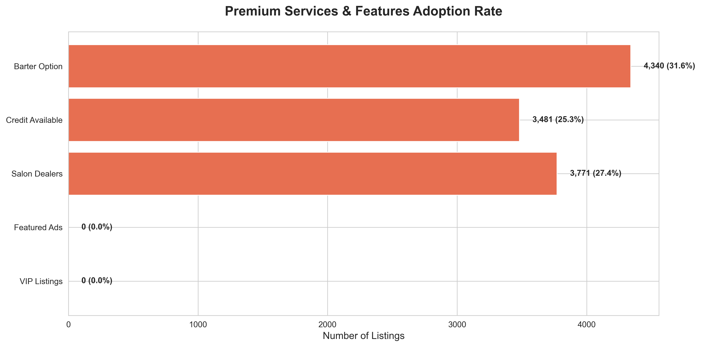

### What This Shows
Premium service adoption is low: VIP Listings (0%), Salon Dealers (27.4%), Credit Available (25.3%), Barter Option (31.6%).

### Why This Matters
- **Untapped Revenue**: 72.6% of listings NOT from professional dealers
- **Financing Gap**: 74.7% of listings don't offer credit - buyers must arrange separately
- **Service Upgrade Opportunity**: Most sellers using basic listings - upsell potential

### Business Actions
1. **Dealer Recruitment**: 72.6% individual sellers - convert top sellers to professional dealer accounts
2. **Financing Partnerships**: Partner with banks/lenders to offer credit on all listings
3. **Premium Tiers**: Create VIP listing packages for private sellers (featured placement, professional photos, priority support)
4. **Barter Platform**: 68.4% don't offer barter - build trade-in valuation tool

---

## Strategic Recommendations

### For Platform Owners (Turbo.az)

**Immediate Actions (0-3 months):**
1. Launch premium listing packages - capture revenue from 13,000+ basic listings
2. Partner with 3-5 banks for integrated financing - address 74.7% gap
3. Create trade-in valuation tool - enable 68.4% without barter option

**Short-term Actions (3-12 months):**
1. Open regional sales centers in Sumqayıt and Gəncə - serve 20.7% underserved market
2. Build hybrid/electric vehicle category with TCO calculators - support 21.5% growing segment
3. Launch certified dealer program - convert high-volume sellers from 72.6% individual base

**Long-term Strategy (12-24 months):**
1. Develop new car dealer portal - capture channel currently outside platform
2. Create vehicle inspection/certification service - address used car trust gap
3. Build logistics network for regional delivery - reduce Baku concentration

---

### For Vehicle Dealers

**Inventory Strategy:**
- **Volume Focus**: Stock 10-25K AZN segment (36% of market) for turnover
- **Margin Focus**: Allocate 20% inventory to 50K+ segment (18.6% of market, higher margins)
- **Avoid**: Manual transmission (except sports cars), diesel vehicles, 15+ year old vehicles

**Geographic Strategy:**
- **Primary**: Maintain Baku presence for access to 79.3% of market
- **Expansion**: Test satellite locations in Sumqayıt (2.6%) and Gəncə (2.3%) for first-mover advantage
- **Online**: Invest in virtual showroom for regional buyers (20.7% of market)

**Service Strategy:**
- **Financing**: Partner with banks - 74.7% of listings lack credit option
- **Trade-Ins**: Build barter/trade-in program - 68.4% of market doesn't offer
- **Certification**: Develop inspection/warranty program to differentiate from 72.6% individual sellers

---

### For Lenders & Financial Institutions

**Market Opportunity:**
- **Size**: 509.8M AZN total inventory value
- **Gap**: Only 25.3% of listings offer credit - 74.7% gap
- **Sweet Spot**: 66% of inventory under 50K AZN - prime lending range

**Product Strategy:**
- **Tier 1** (10-25K AZN): Low-doc, fast-approval for mass market
- **Tier 2** (25-50K AZN): Standard auto loans, 3-5 year terms
- **Tier 3** (50K+ AZN): Premium lending, longer terms, lower rates for qualified buyers

**Distribution Strategy:**
- **Platform Integration**: Partner with Turbo.az for embedded financing
- **Dealer Network**: Build relationships with 27.4% salon dealers for referrals
- **Regional Expansion**: Follow market to underserved cities (Sumqayıt, Gəncə)

---

### For Automotive Manufacturers

**Market Entry Insights:**
- **Opportunity**: 54.1% market share held by fragmented smaller brands
- **Positioning Gap**: Limited options between value brands (Hyundai ~22K) and premium (Mercedes ~55K)
- **Growth Segment**: Hybrid/electric only 21.5% - early mover advantage available

**Go-to-Market Strategy:**
- **Price Point**: Target 28-38K AZN range (gap between mass and premium)
- **Product**: Hybrid SUV/Crossover with automatic transmission
- **Channel**: Partner with existing dealer network (27.4% professional sellers)

**Regional Strategy:**
- **Launch**: Baku first (79.3% of market)
- **Expand**: Sumqayıt and Gəncə after establishing brand
- **Online**: Invest in digital presence for regional reach

---

## Key Performance Indicators to Monitor

### Market Health Indicators

| Metric | Current Value | Target | Status |
|--------|--------------|--------|---------|
| Total Active Listings | 13,745 | 15,000+ | Stable |
| Average Listing Price | 37,171 AZN | Monitor trend | Baseline |
| Median Listing Price | 24,700 AZN | Monitor trend | Baseline |
| Top 5 Brand Concentration | 45.9% | <50% | Healthy |
| Geographic Concentration | 79.3% Baku | <70% | Risk |

### Growth Opportunity Indicators

| Metric | Current Value | Opportunity | Priority |
|--------|--------------|-------------|----------|
| Premium Services Adoption | 27.4% | 50%+ | High |
| Credit Availability | 25.3% | 60%+ | High |
| Green Vehicle Share | 21.5% | 35%+ | Medium |
| Regional Market Share | 20.7% | 30%+ | Medium |
| Automatic Transmission | 79.3% | 85%+ | Low |

---

## Charts & Visualizations Reference

All charts are located in the `/charts` directory and are generated from current market data.

| Chart | Business Question Answered |
|-------|---------------------------|
| `01_price_distribution.png` | Where is the market opportunity by price segment? |
| `02_brand_volume.png` | Who are the market leaders and by how much? |
| `03_brand_pricing.png` | Which brands command premium pricing? |
| `04_year_trends.png` | What is the age profile of market inventory? |
| `05_fuel_type_market.png` | What is the green vehicle opportunity size? |
| `06_transmission_preference.png` | What transmission type do customers prefer? |
| `07_geographic_distribution.png` | Where are the vehicles located? |
| `08_price_depreciation.png` | How do vehicles depreciate by age? |
| `09_new_vs_used_market.png` | What is the new vs used market split? |
| `10_mileage_profile.png` | What mileage ranges dominate the market? |
| `11_premium_services.png` | What services are sellers offering? |
| `12_market_concentration.png` | How concentrated is the market? |

---

## Conclusion

The Azerbaijan automotive market represents a significant commercial opportunity with clear paths to value creation:

1. **Market Size**: 509.8M AZN inventory value with 13,745 active listings
2. **Fragmentation**: 54% market share available beyond top 5 brands - room for disruption
3. **Service Gap**: 70%+ of listings lack premium services - monetization opportunity
4. **Geographic Concentration**: 79% in Baku - regional expansion potential
5. **Green Transition**: 21.5% hybrid/electric vs global 40-50% - growth runway

**The market is ripe for players who can:**
- Provide integrated financing (74.7% gap)
- Expand to regional markets (20.7% underserved)
- Offer premium services (72.6% basic listings)
- Lead green vehicle adoption (21.5% vs global trend)

**Success will require:**
- Customer-first approach (simplify buying process)
- Technology investment (online sales, virtual showrooms)
- Partnership strategy (banks, logistics, service centers)
- Data-driven decision making (price optimization, inventory mix)

---

*Market Intelligence Report Generated: December 2025*

*Data Source: Turbo.az Platform (13,745 listings)*

*Report Focus: Strategic Business Insights & Decision Support*

