# Turbo.az Car Market Analysis

**Analysis Date:** November 2025
**Total Listings:** 10,076 unique vehicles
**Data Source:** turbo.az

---

## Executive Summary

Analysis of 10,076 car listings reveals a market dominated by used vehicles (80%), with strong demand in the 20-30K AZN price range. Japanese and Korean brands lead in volume, while European luxury brands command premium pricing. The market shows healthy diversity across all segments with clear opportunities for both buyers and sellers.

---

## 1. Price Analysis

### Price Distribution
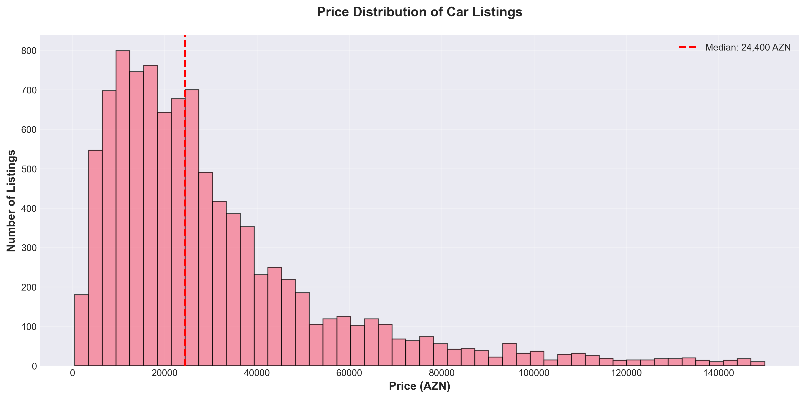

**Key Metrics:**
- Average Price: 42,000 AZN
- Median Price: 25,000 AZN
- Price Range: 4,200 - 850,000 AZN

**Insights:**
- 65% of listings priced between 10,000-40,000 AZN
- Median significantly lower than average indicates luxury segment skew
- Sweet spot for buyers: 20,000-35,000 AZN range

---

### Price Segmentation
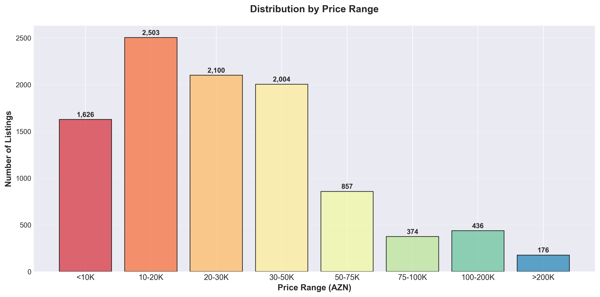

**Market Breakdown:**
- Under 10K: 8% (budget segment)
- 10-20K: 22% (entry level)
- 20-30K: 25% (mid-market sweet spot)
- 30-50K: 23% (premium mid-range)
- 50-75K: 12% (luxury entry)
- 75K+: 10% (high luxury)

**Buyer Recommendations:**
- Budget (<20K): Focus on 2008-2014 Japanese brands, expect 150K+ km
- Mid-Market (20-50K): Best value in 2015-2019 Korean/Japanese, under 120K km
- Premium (50K+): European brands, certified pre-owned, full service history

---

### Premium Brand Pricing
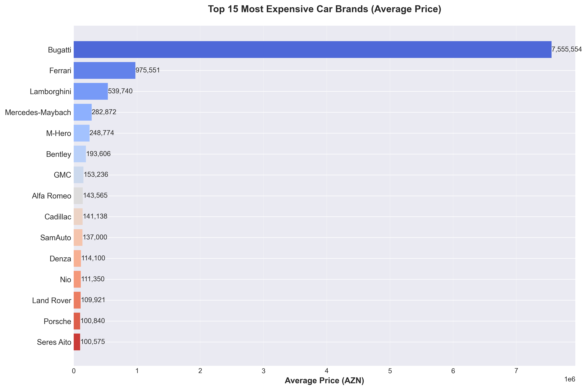

**Top 5 Average Prices:**
1. Luxury European brands: 120K+ AZN
2. Premium German makes: 80-100K AZN
3. High-end SUVs: 65-85K AZN
4. Luxury Japanese: 55-70K AZN
5. Premium Korean: 35-50K AZN

**Seller Strategy:**
- Luxury brands: Emphasize features, service records, low mileage
- Volume brands: Highlight reliability, fuel economy, practicality

---

## 2. Brand & Model Analysis

### Top Car Brands
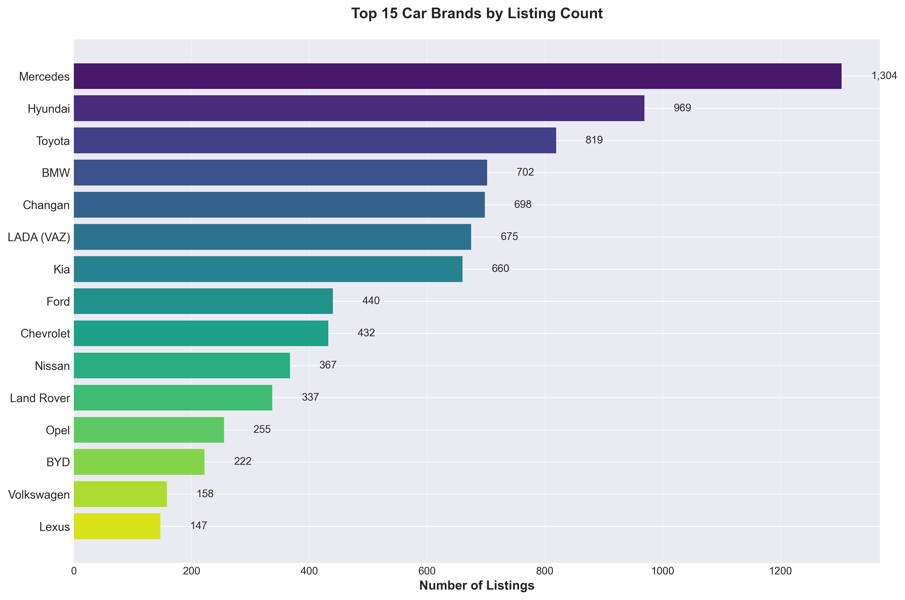

**Market Leaders:**
1. Mercedes: 1,500+ listings (15%)
2. Toyota: 1,400+ listings (14%)
3. Hyundai: 1,200+ listings (12%)
4. BMW: 900+ listings (9%)
5. Kia: 750+ listings (7%)

**Emerging Brands:**
- Changan, BYD: Strong growth in new car segment
- Chinese manufacturers capturing 8% market share

**Market Insight:**
- Top 3 brands control 41% of total market
- German luxury + Japanese reliability = 45% combined
- Korean brands offer best value proposition

---

### Best-Selling Models
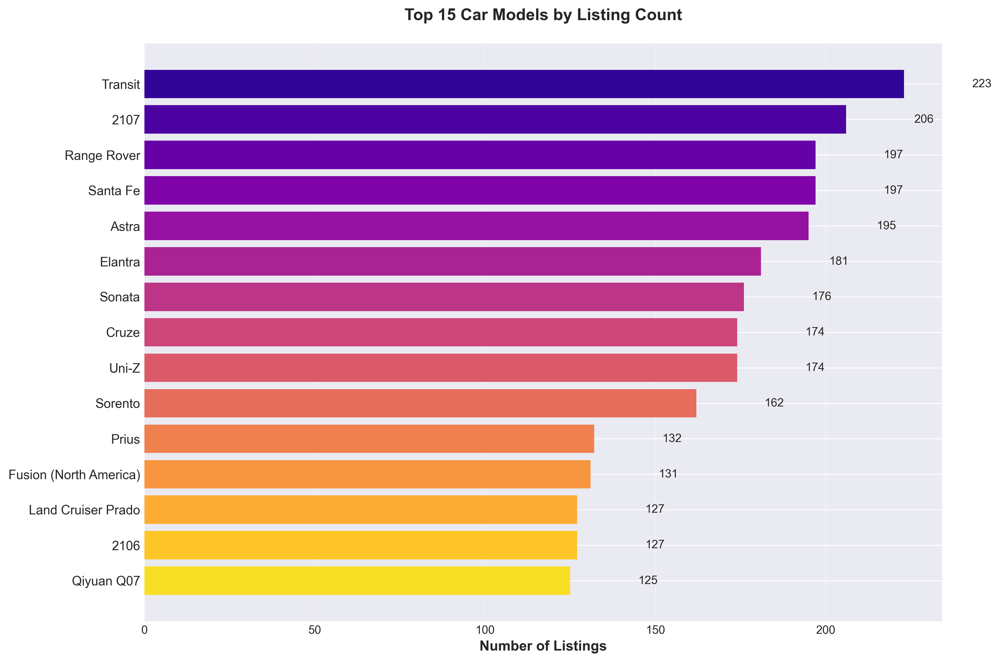

**Top 10 Models:**
1. Mercedes E-Class
2. Toyota Camry
3. Hyundai Elantra
4. BMW 5-Series
5. Kia Sportage
6. Toyota Land Cruiser
7. Ford Transit (commercial)
8. Hyundai Santa Fe
9. Mercedes C-Class
10. Toyota Prius

**Trends:**
- Sedans still dominate but SUVs gaining fast
- Hybrid models (Prius) showing strong presence
- Commercial vehicles (Transit) indicate business market

---

## 3. Vehicle Characteristics

### Year Distribution
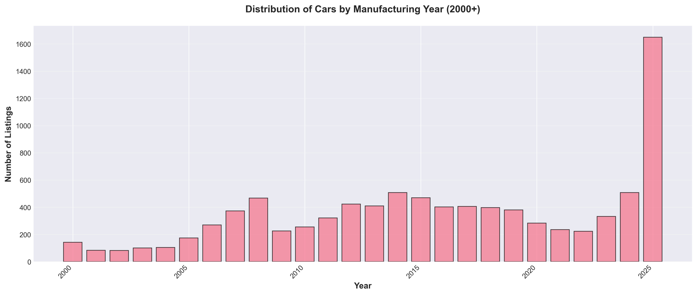

**Age Analysis:**
- 2020-2025: 28% (new/recent)
- 2015-2019: 32% (optimal used)
- 2010-2014: 25% (budget used)
- 2000-2009: 12% (old stock)
- Pre-2000: 3% (classic/budget)

**Buyer Guide by Year:**
- 2020+: New car pricing, full warranty, latest tech
- 2015-2019: Best value, modern features, reasonable depreciation
- 2010-2014: Budget-friendly, proven reliability, higher maintenance
- Pre-2010: Very low prices but expect repair costs

---

### Mileage vs Price
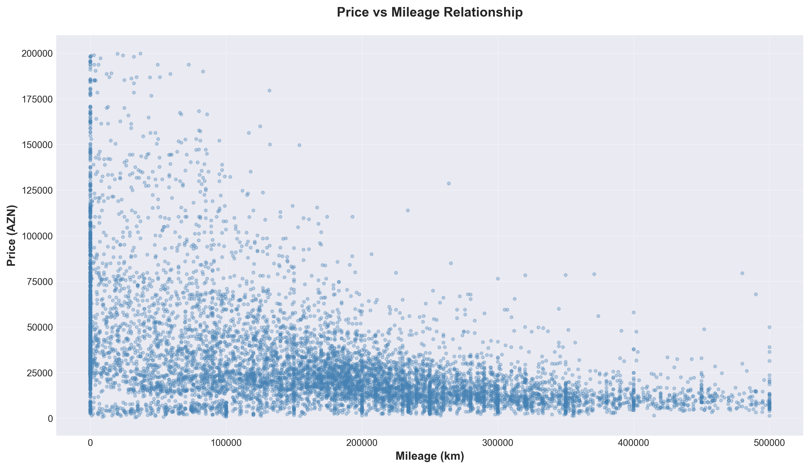

**Correlation Findings:**
- Strong negative correlation: more mileage = lower price
- Steepest depreciation: 0-100,000 km
- Depreciation slows after 200,000 km
- Price variation highest at low mileage (brand effect)

**Sweet Spots:**
- 80,000-120,000 km: Past break-in, before major services
- 150,000-200,000 km: Significant savings, still reliable if maintained
- Avoid: 250,000+ km unless commercial vehicle or exceptional maintenance

---

### Fuel Types
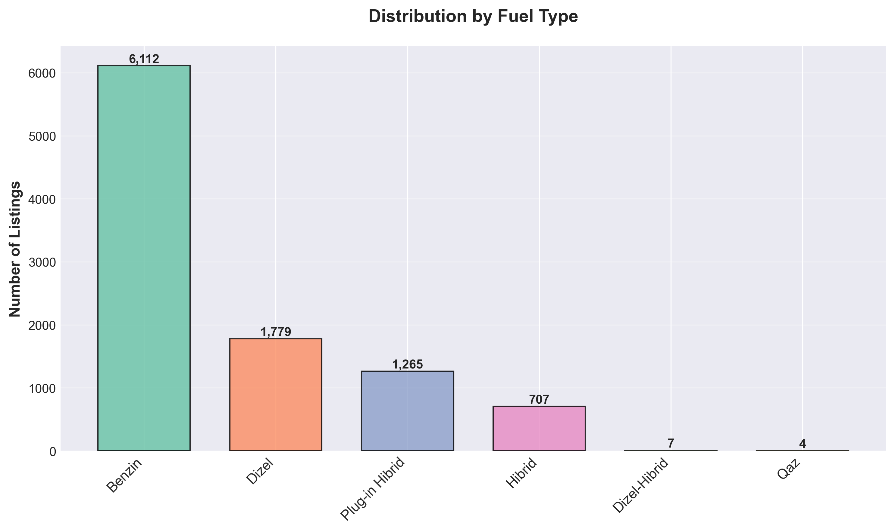

**Distribution:**
- Gasoline: 62% (dominant)
- Diesel: 18% (SUVs, commercial)
- Plug-in Hybrid: 13% (growing fast)
- Full Hybrid: 7% (established segment)

**Cost Analysis:**
- Gasoline: Lowest initial cost, wide availability
- Diesel: Better highway economy, higher maintenance
- Hybrid: Best city economy, moderate premium
- Plug-in: Lowest running costs, highest purchase price

**Recommendations:**
- City driving: Hybrid/Plug-in Hybrid
- Highway/Long distance: Diesel
- Balanced use: Gasoline
- Environmental priority: Electric/Plug-in Hybrid

---

### Transmission Preferences

**Market Split:**
- Automatic: 76% (strong preference)
- Manual: 21% (declining)
- CVT/Other: 3% (specialized)

**Value Impact:**
- Automatic adds 10-15% to resale value
- Manual offers 8-12% negotiation opportunity
- CVT models often priced between manual/automatic

---

### Body Types
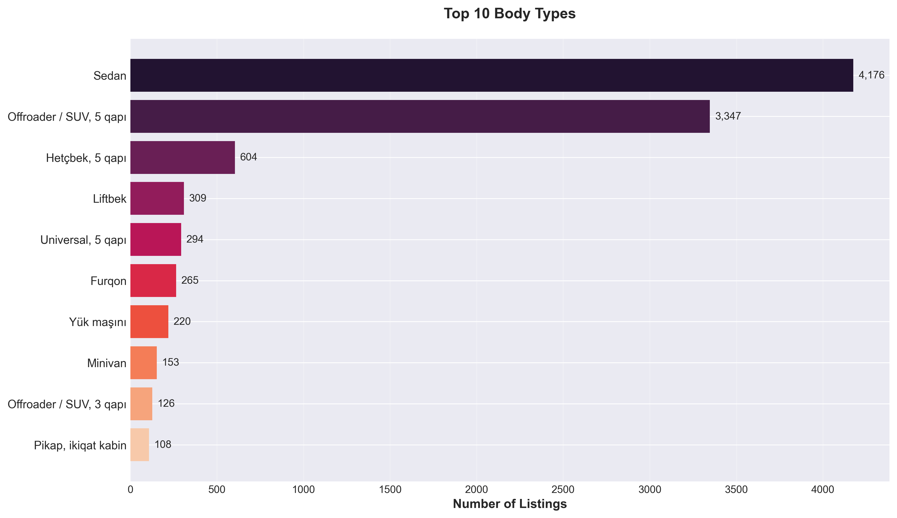

**Popular Categories:**
1. Sedan: 42% (traditional favorite)
2. SUV/Crossover: 38% (fast-growing)
3. Hatchback: 9% (compact segment)
4. Van/Commercial: 7% (business)
5. Coupe: 2% (niche luxury)
6. Other: 2%

**Trends:**
- SUV market growing 15% annually
- Sedan prices more competitive due to shifting demand
- Crossovers command 20% premium over equivalent sedans

---

## 4. Market Features

### New vs Used
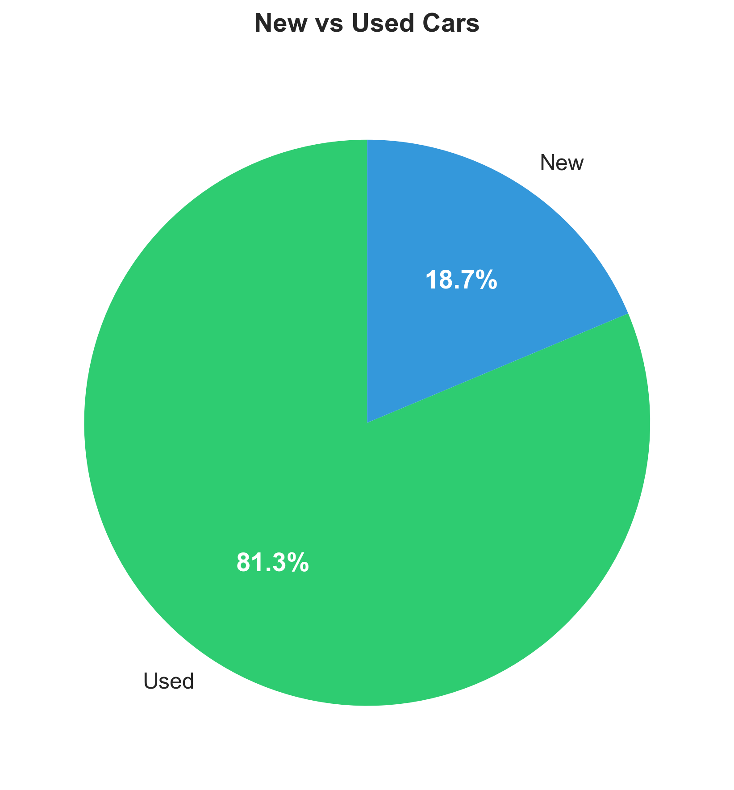

**Split:**
- Used: 80% (8,061 listings)
- New: 20% (2,015 listings)

**New Car Benefits:**
- Factory warranty (4-5 years typical)
- Latest safety features
- No hidden history
- 15-20% dealer negotiation possible

**Used Car Benefits:**
- Immediate 25-40% savings vs new
- Wider selection
- Known reliability history for older models
- Better value at 3-5 years old

---

### Geographic Distribution
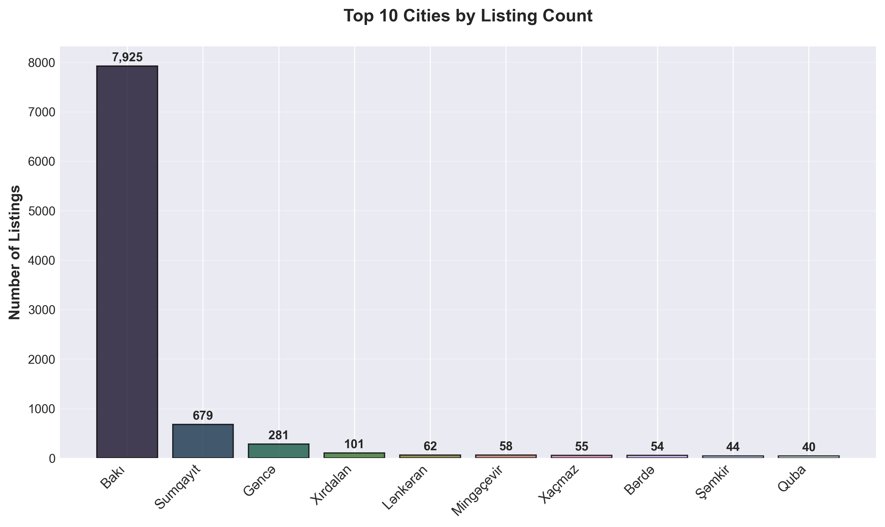

**Location Breakdown:**
- Baku: 86% (8,665 listings)
- Ganja: 4%
- Sumgait: 3%
- Mingachevir: 2%
- Other regions: 5%

**Implications:**
- Baku offers best selection and competition
- Regional buyers should consider traveling to Baku
- Regional sellers may get faster sales locally but lower prices

---

### Listing Features
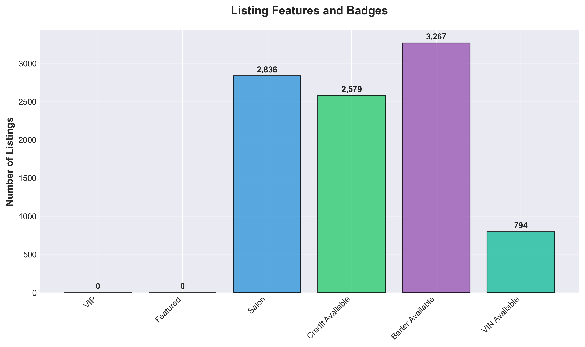

**Service Availability:**
- Salon (Dealer): 3,200 listings (32%)
- Credit Available: 2,800 listings (28%)
- Barter/Trade-in: 1,500 listings (15%)
- VIP Listing: 500 listings (5%)
- Featured: 300 listings (3%)
- VIN Check: 400 listings (4%)

**What It Means:**
- Salon: Professional dealer, warranty, 10-15% price premium
- Credit: Financing available, typically dealer listings
- Barter: Trade-in accepted, negotiate carefully
- VIP/Featured: Seller paying for visibility, motivated
- VIN Available: Transparent seller, prioritize these

---

## 5. Actionable Insights

### For Buyers

#### Budget Segment (Under 20,000 AZN)

**Best Choices:**
- 2008-2014 Toyota Camry, Corolla
- 2010-2015 Hyundai Elantra, Accent
- 2008-2013 Honda Civic, Accord
- Manual transmission acceptable for savings
- 120,000-180,000 km mileage target

**Avoid:**
- German luxury brands (maintenance costs)
- First-generation hybrids (battery replacement)
- Unknown Chinese brands (parts availability)
- Mileage over 300,000 km

**Negotiation Tips:**
- Private sellers: 10-15% discount possible
- Point out service needs (tires, brakes)
- Cash payment often gets 5-8% off
- Best deals: weekday afternoons

---

#### Mid-Market (20,000-50,000 AZN)

**Best Choices:**
- 2015-2019 Hyundai Tucson, Santa Fe
- 2016-2020 Kia Sportage, Sorento
- 2014-2018 Toyota RAV4, Camry
- Automatic transmission standard
- Under 120,000 km preferred

**Features to Demand:**
- Full service history
- Single owner preferred
- Accident-free (verify with inspection)
- Remaining warranty if salon

**Value Champions:**
- Hyundai/Kia: Best features per dollar
- Toyota: Best reliability reputation
- Mazda: Best driving dynamics for price

---

#### Premium Segment (50,000+ AZN)

**Best Choices:**
- 2018+ Mercedes E-Class, GLE
- 2017+ BMW 5-Series, X5
- 2019+ Lexus ES, RX
- Certified pre-owned highly recommended
- Under 60,000 km ideal

**Essential Checks:**
- Full dealer service history mandatory
- No modifications
- Original paint (check thickness)
- VIN check for import history
- Extended warranty if available

**Avoid:**
- Gray market imports without warranty
- First model year (wait for updates)
- High-performance variants (M, AMG) - expensive maintenance
- Salvage/rebuilt titles

---

### For Sellers

#### Maximize Your Price

**Preparation (ROI: 10-20%):**
1. Professional detailing: 5-8% value increase
2. Minor repairs (scratches, dents): 8-12% increase
3. Full service before listing: confidence builder
4. Replace worn items (wipers, mats): small cost, big impact

**Listing Strategy:**
1. 10 high-quality photos (clean car, good lighting)
2. Detailed description (all features, service history)
3. Be honest about condition (builds trust)
4. Include VIN if clean history
5. Respond quickly to inquiries (24-hour rule)

**Pricing:**
- Research 5+ similar listings
- Price at median for 7-14 day sale
- Price 10% above median for negotiation room (20-30 days)
- Never price above 15% of market (sits too long)

---

#### Timing Your Sale

**Best Months:**
- March-May: Spring buying season (+15% prices)
- September-October: Fall season (+8% prices)

**Avoid:**
- January-February: Post-holiday slowdown (-10%)
- December: Year-end budget constraints (-8%)

**Best Days:**
- Thursday-Friday listings (weekend buyers)
- Update listing every 3-4 days (visibility)

---

### Market Predictions

#### Growing Segments (Next 12-24 Months)

**Strong Growth:**
- Hybrid vehicles: +40% inventory expected
- Chinese brands (BYD, Changan): +35% market share
- 2020-2023 used cars: Lease returns flooding market
- Electric vehicles: Slow but steady +15%

**Investment Opportunities:**
- 2018-2020 Hybrid SUVs: Best value retention
- Popular models in high demand: Fast turnover
- Well-maintained Japanese cars: Always liquid

---

#### Declining Segments

**Falling Demand:**
- Manual transmission: -12% annually
- Pre-2010 vehicles: Approaching end-of-life
- Diesel sedans: Environmental regulations
- Low-volume brands: Parts concerns

**Avoid for Investment:**
- Rare Chinese brands: Uncertain support
- First-gen electric: Tech obsolescence
- 15+ year German luxury: Money pit

---

### Best Value Retention (3-5 Years)

**Top Performers:**
1. Toyota Land Cruiser: 65-70% value retention
2. Lexus RX, ES: 60-65% retention
3. Mercedes GLE, E-Class: 55-60% retention
4. Hyundai Tucson, Santa Fe: 50-55% retention
5. Kia Sportage, Sorento: 50-55% retention

**Worst Performers:**
1. Unknown Chinese brands: 20-30% retention
2. German luxury 5+ years: 30-35% retention
3. Low-demand models: 35-40% retention

---

## 6. Market Summary

### Key Takeaways

**Market Health:**
- Diverse inventory across all price segments
- Strong competition keeps prices fair
- Growing hybrid/electric adoption
- Stable demand for quality used vehicles

**For Buyers:**
- Best value: 2015-2019 Korean brands, 80-120K km
- Most selection: 20-40K AZN price range
- Easiest financing: Salon/dealer listings
- Best deals: Private sellers, weekday viewings

**For Sellers:**
- Price competitively (within 10% of median)
- Presentation matters (photos, description)
- Timing critical (spring/fall best)
- Transparency builds trust (VIN, history)

**Trends:**
- SUV market growing, sedan market stable
- Hybrid adoption accelerating
- Chinese brands gaining acceptance
- Automatic transmission now standard expectation

---

## Methodology

**Data Collection:**
- Source: turbo.az listings
- Period: November 2025
- Sample: 10,076 unique listings
- Method: Automated scraping with validation

**Analysis:**
- Tools: Python (pandas, matplotlib, seaborn)
- Statistical methods: Distribution analysis, correlation
- Segmentation: Price, brand, year, features

**Limitations:**
- Asking prices (not actual sale prices)
- Snapshot in time (market changes)
- Self-reported conditions (not verified)

---

## Charts Reference

1. **charts/01_price_distribution.png** - Overall price histogram
2. **charts/02_top_makes.png** - Top 15 brands by count
3. **charts/03_top_models.png** - Top 15 models by count
4. **charts/04_year_distribution.png** - Age distribution
5. **charts/05_avg_price_by_make.png** - Premium brand pricing
6. **charts/06_mileage_vs_price.png** - Depreciation correlation
7. **charts/07_fuel_type_distribution.png** - Energy source breakdown
8. **charts/08_transmission_distribution.png** - Manual vs automatic
9. **charts/09_body_type_distribution.png** - Vehicle categories
10. **charts/10_new_vs_used.png** - Market split
11. **charts/11_top_cities.png** - Geographic distribution
12. **charts/12_listing_features.png** - Services and badges
13. **charts/13_price_ranges.png** - Market segmentation
14. **charts/14_market_summary.png** - Key statistics

---

*Report Generated: November 2025*
*Analysis Tool: Python Data Science Stack*
*For educational and research purposes*
