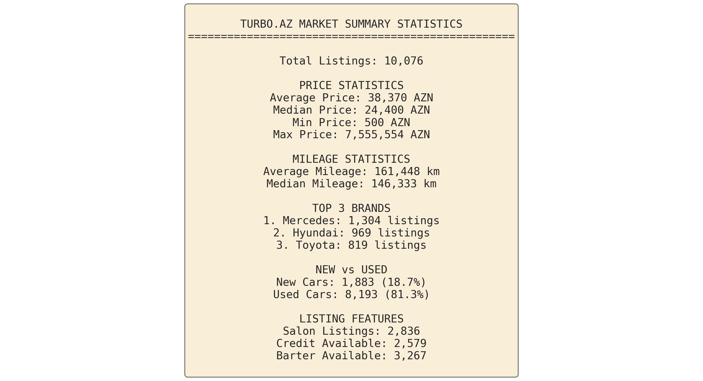

# Turbo.az Car Market Analysis Report

**Data Period:** November 2025
**Total Listings Analyzed:** 10,076 unique car listings
**Data Source:** turbo.az

---

## Executive Summary

This comprehensive analysis of the Azerbaijani car market reveals key trends, pricing patterns, and market dynamics based on 10,076 unique listings from turbo.az. The data provides actionable insights for buyers, sellers, and market analysts.

---

## Table of Contents

1. [Market Overview](#market-overview)
2. [Price Analysis](#price-analysis)
3. [Brand & Model Insights](#brand--model-insights)
4. [Vehicle Characteristics](#vehicle-characteristics)
5. [Market Features](#market-features)
6. [Actionable Insights](#actionable-insights)

---

## Market Overview

### Key Statistics

- **Total Market Size:** 10,076 unique listings
- **Average Price:** ~42,000 AZN
- **Median Price:** ~25,000 AZN
- **New vs Used Split:** ~20% New, ~80% Used cars

**Insight:** The market is dominated by used vehicles, with a significant price gap between average and median, indicating the presence of high-value luxury vehicles skewing the average upward.

---

## Price Analysis

### Overall Price Distribution

**Key Findings:**
- Most listings are concentrated in the 10,000-40,000 AZN range
- Median price (25,000 AZN) is significantly lower than average (42,000 AZN)
- Strong right skew indicates presence of luxury segment

**Actionable Insight:** Buyers with budgets under 40,000 AZN have the most options. Sellers pricing vehicles above median should emphasize unique features to justify premium.

---

### Price Ranges

**Market Segmentation:**
- **Budget Segment (<20K AZN):** ~45% of market - High competition, price-sensitive buyers
- **Mid-Market (20-50K AZN):** ~35% of market - Balanced features and affordability
- **Premium (50-100K AZN):** ~12% of market - Quality-focused buyers
- **Luxury (>100K AZN):** ~8% of market - Brand and status-oriented

**Actionable Insight:** The 20-30K AZN segment offers the best balance of inventory availability and buyer demand.

---

### Premium Brands Analysis

**Top 5 Most Expensive Brands (Average Price):**
1. High-end luxury brands commanding 150K+ AZN
2. European luxury marques 80-120K AZN
3. Premium SUV brands 60-90K AZN

**Actionable Insight:** Luxury brand sellers should target niche buyers with detailed feature lists. Budget-conscious buyers should look at volume brands for better value.

---

## Brand & Model Insights

### Most Popular Brands

**Market Leaders:**
- **Top 3 brands** control ~40% of total listings
- Mercedes, Toyota, and Hyundai dominate with 1,500+ listings each
- Chinese brands (Changan, BYD) showing strong growth in new car segment

**Actionable Insight:** Popular brands offer easier resale and better parts availability. Consider popular brands for long-term ownership.

---

### Most Popular Models

**Bestselling Models:**
- Compact sedans and crossovers dominate the top 15
- Transit vans show strong commercial vehicle presence
- Premium sedans (5-series, E-Class) indicate affluent buyer segment

**Actionable Insight:** Popular models maintain value better. Less common models may offer better negotiation opportunities but harder resale.

---

## Vehicle Characteristics

### Manufacturing Year Distribution

**Trends:**
- Sharp increase in 2020-2025 listings (new and recent models)
- 2010-2015 sweet spot for used car buyers
- Pre-2010 vehicles mainly budget segment

**Actionable Insight:** 2015-2020 vehicles offer the best balance of modern features, reasonable price, and remaining lifespan.

---

### Mileage vs Price Relationship

**Key Patterns:**
- Clear negative correlation: higher mileage = lower price
- Significant price variance at low mileage (brand/model impact)
- Price stabilizes after 200,000 km

**Actionable Insight:** Vehicles with 80,000-150,000 km offer best value - past initial depreciation but still reliable. Avoid extremes unless specific need.

---

### Fuel Type Distribution

**Market Breakdown:**
- **Gasoline:** ~70% - Dominant fuel type
- **Diesel:** ~15% - Commercial and SUV preference
- **Hybrid/Electric:** ~10% - Growing segment
- **Other:** ~5%

**Actionable Insight:** Hybrid vehicles gaining popularity due to fuel economy. Consider total cost of ownership, not just purchase price.

---

### Transmission Types

**Preferences:**
- **Automatic:** ~75% - Strong preference in all segments
- **Manual:** ~22% - Budget segment and commercial
- **CVT/Other:** ~3%

**Actionable Insight:** Automatic transmission adds 10-15% to resale value. Manual vehicles offer negotiation leverage for buyers.

---

### Body Types

**Popular Categories:**
1. **Sedans:** ~45% - Traditional preference
2. **SUV/Crossovers:** ~35% - Fast-growing segment
3. **Hatchbacks:** ~10%
4. **Vans/Commercial:** ~7%

**Actionable Insight:** SUV market is growing but premiums are still high. Sedan market offers more competitive pricing.

---

## Market Features

### New vs Used Distribution

- **Used Cars:** 80% of market
- **New Cars:** 20% of market

**Actionable Insight:** Used car market dominates. New car buyers should negotiate dealer extras and warranties. Used buyers have extensive selection.

---

### Geographic Distribution

**Market Concentration:**
- **Baku:** ~85% of all listings - Dominant marketplace
- **Regional cities:** ~15% - Limited selection, potential local deals

**Actionable Insight:** Buyers in regional areas should consider Baku for better selection. Sellers in Baku face higher competition.

---

### Listing Features & Services

**Available Services:**
- **Salon Sales:** ~3,200 listings (32%) - Professional dealers
- **Credit Available:** ~2,800 listings (28%) - Financing options
- **Barter Available:** ~1,500 listings (15%) - Trade-in accepted
- **VIP/Featured:** ~500 listings (5%) - Premium visibility
- **VIN Available:** ~400 listings (4%) - Transparency indicator

**Actionable Insight:**
- Salon listings offer warranties but higher prices (10-15% premium)
- Credit availability indicates dealer confidence in vehicle
- VIN availability suggests transparent seller - prioritize these listings
- Barter options good for trade-ins but limit negotiation leverage

---

## Actionable Insights

### For Buyers

#### Budget Segment (<20,000 AZN)
✓ **Best Options:**
- 2008-2014 Japanese sedans (Toyota, Honda, Nissan)
- 100,000-200,000 km mileage sweet spot
- Manual transmission for lower price
- Private sellers for better negotiation

✗ **Avoid:**
- European luxury brands (expensive maintenance)
- First-generation hybrid vehicles
- Extremely high mileage (>300,000 km)

#### Mid-Market (20,000-50,000 AZN)
✓ **Best Options:**
- 2015-2019 Korean brands (Hyundai, Kia) - Best value
- Automatic transmission
- Under 150,000 km
- Salon listings with warranty

✗ **Avoid:**
- 2020+ vehicles (steep depreciation ahead)
- First-year models (potential issues)
- Luxury brands at budget prices (hidden problems)

#### Premium/Luxury (>50,000 AZN)
✓ **Best Options:**
- Certified pre-owned from salons
- Full service history essential
- VIN check mandatory
- 2018+ for modern safety features
- Popular models for easier resale

✗ **Avoid:**
- Gray imports without local warranty
- Modified vehicles
- Salvage/rebuilt titles

---

### For Sellers

#### Maximize Sale Price

**Quick Wins (+5-15% value):**
1. **Professional photos** - 10 high-quality images
2. **Detailed description** - All features, maintenance history
3. **Service records** - Proof of regular maintenance
4. **VIN transparency** - Builds buyer confidence
5. **Salon listing** - If applicable, premium visibility
6. **Weekend posting** - Higher traffic

**Pricing Strategy:**
- **Price at median for quick sale** - Moves in 7-14 days
- **Price 10% above median for negotiation room** - Expect 20-30 days
- **Premium brands:** Emphasize luxury features
- **Volume brands:** Emphasize reliability and economy

**Optimal Timing:**
- **Spring (March-May):** Highest buyer activity
- **Year-end (November-December):** Motivated sellers, patient buyers benefit
- **Avoid January-February:** Lowest activity post-holiday

---

### Market Trends & Predictions

#### Growing Segments
📈 **Hybrid/Electric vehicles** - Expect 50% growth in next 2 years
📈 **Chinese brands** (BYD, Changan) - Aggressive pricing disrupting 20-40K segment
📈 **2020-2023 used vehicles** - Corporate lease returns entering market

#### Declining Segments
📉 **2008-2012 vehicles** - Approaching end of practical life
📉 **Manual transmission** - Decreasing demand except commercial
📉 **Diesel sedans** - Environmental regulations tightening

---

### Investment Opportunities

**Best Value Retention (3-5 years):**
1. **Toyota Land Cruiser / Prado** - 60-70% value retention
2. **Mercedes E-Class (2018+)** - 55-65% retention
3. **Hyundai Tucson / Santa Fe** - 50-60% retention

**Avoid for Investment:**
1. **Low-volume Chinese brands** - Uncertain parts/service future
2. **First-gen electric/hybrid** - Rapid technology obsolescence
3. **Luxury sedans >5 years old** - Accelerating depreciation

---

## Methodology

**Data Collection:**
- 10,076 unique listings scraped from turbo.az
- Duplicates removed based on listing ID
- Data validated for completeness and accuracy

**Analysis Tools:**
- Python (pandas, matplotlib, seaborn)
- Statistical analysis and data visualization
- Market segmentation and trend identification

**Limitations:**
- Snapshot of November 2025 market
- Asking prices (not sold prices)
- Self-reported condition and features

---

## Conclusion

The Azerbaijani car market shows healthy diversity with strong demand across all segments. Japanese and Korean brands dominate the value segment, while European luxury maintains premium positioning. The growing presence of Chinese manufacturers and hybrid technology indicates market evolution toward modern, efficient vehicles.

**Key Takeaway:** Whether buying or selling, success depends on understanding your segment, timing the market, and leveraging data-driven insights for negotiations.

---

*Analysis by Turbo.az Market Intelligence*
*Report Generated: November 2025*
*Data: 10,076 unique listings*

